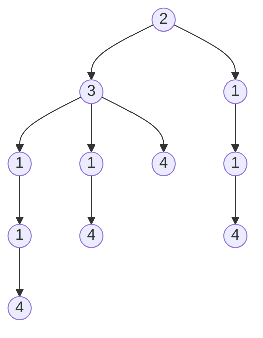
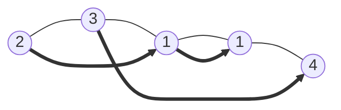

## 题目描述

[题目原链接](https://leetcode-cn.com/problems/jump-game-ii/)

```
给定一个非负整数数组，你最初位于数组的第一个位置。

数组中的每个元素代表你在该位置可以跳跃的最大长度。

你的目标是使用最少的跳跃次数到达数组的最后一个位置。

示例:

输入: [2,3,1,1,4]
输出: 2
解释: 跳到最后一个位置的最小跳跃数是 2。
     从下标为 0 跳到下标为 1 的位置，跳 1 步，然后跳 3 步到达数组的最后一个位置。
说明:

假设你总是可以到达数组的最后一个位置。

来源：力扣（LeetCode）
链接：https://leetcode-cn.com/problems/jump-game-ii
著作权归领扣网络所有。商业转载请联系官方授权，非商业转载请注明出处。
```


## 解题思路

如下图，这一题和之前做过的[LeetCode754-到达终点数字](http://seedxl.tech/2020/09/09/LeetCode754-%E5%88%B0%E8%BE%BE%E7%BB%88%E7%82%B9%E6%95%B0%E5%AD%97/)有点类似，就是从起点出发到终点，有很多种不同的走法，然后需要找出一个最优的走沙。如果单纯只是为了解这道题的话，可以用DFS遍历所有可能的路径，然后再找出最少的步数。但是这个方法过于暴力，而且就像754那道题一样，需要遍历路径树的所有结点，时间复杂度会很高。而且就和那道题一样，对于这类在众多路径之中，找最少/最近/最短的路径，BFS算法天然的契合，如果每一层的结点不是那么多的话，BFS应该是可以通过的，所以决定先用BFS试试下。




## 代码实现

```c#
/*
[2,3,1,1,4]
[1]
[0]
[1,1]
[1,2,1]
[1,1,1]
[1,2,0,1,1]
[1,4,0,0,0,2,1,3,0,0,0]
*/


public class Solution {
    public int Jump(int[] nums)
    {
        if( nums.Length <= 1 )
        {
            return 0 ; 
        }

        //按层遍历的队列
        Queue<int> waitProcess = new Queue<int>(100)  ;

        //当前正在遍历的层的节点数目
        int curLayerCnt = 0 ; 
        //下一层有多少的节点需要遍历
        int nextLayerCnt = 0 ; 
        int stepCnt = 0 ;  //有多少层，就代表现在走到第几步
        int finalPosIdx = nums.Length - 1 ; 
        int totalNums = nums.Length ;

        waitProcess.Enqueue(0) ; 
        curLayerCnt++  ; 
        nextLayerCnt = 0 ; 
        stepCnt++  ;

        while( waitProcess.Count > 0 )
        {
            int curStepIdx = waitProcess.Dequeue() ; 
            int curIdxMaxStep = nums[curStepIdx]  ; 

            if( curStepIdx + curIdxMaxStep >= finalPosIdx )
            {
                break ;
            }

            for( int i = curStepIdx + 1 ;
              i <= (curStepIdx + curIdxMaxStep) && i < totalNums && curIdxMaxStep != 0  ;
              ++i )
            {
                //遍历到数组第i个结点，它最大可以走nums[i]的长度，所以它下面总共有nums[i]的结点可以尝试，也就是下一层需要加这么多的结点  
                waitProcess.Enqueue(i)  ;
                nextLayerCnt++ ;
            }

            curLayerCnt-- ; 
            if( curLayerCnt == 0 )
            {
                //如果目前所处在的层的结点都遍历完了，还没有到达目的地，就要再走一步试试。
                stepCnt++  ;
                curLayerCnt = nextLayerCnt ; 
                nextLayerCnt = 0 ; 
            }
        }
        
        return stepCnt ; 
    }
}
```


###  解题结果


很可惜，超时了，看起来按层遍历的方法，所遍历到的节点数目仍然是非常多。那么有没有办法可以优化一下呢？例如减少一下需要遍历的节点数目？

来分析一下，我们是不是需要将每一层的所有节点都尝试走一下呢? 

拿题目的输入数据**[2,3,1,1,4]**来举例，对于同样从**起点2**出发而来的第2层的**节点3**和**节点1**来说，是不是都需要尝试遍历一下呢。显然不是，处在同一层的**节点3**，它可以走的路径之中，本身就包含了从**节点1**出发的路径，所以我们可以进去**剪枝**


那么**剪枝**的基准是什么呢？我们想要做的是，走过的路径不重复走，而根据题目的描述，**nums[i]**代表的是从**i**所处的位置，可以最大走**nums[i]**步，也就是说**nums[i]**代表的是一个**[i,nums[i]]**的区间，那我们去重要做的就是**只遍历右闭区间中下标最大那个的区间**，其余的区间不再遍历，因为其可能可以走的下标 ，都已经被下标最大的那个区间包含在其中了。


## 剪枝后的代码实现

```c#
/*
[2,3,1,1,4]
[1]
[0]
[1,1]
[1,2,1]
[1,1,1]
[1,2,0,1,1]
[1,4,0,0,0,2,1,3,0,0,0]
[4,6,5,4,3,0,0,1]
[10,9,8,7,6,5,4,3,2,1,1,0]
*/


public class Solution {
    public int Jump(int[] nums)
    {
        if( nums.Length <= 1 )
        {
            return 0 ; 
        }

        Queue<int> waitProcess = new Queue<int>(100)  ;

        int curLayerCnt = 0 ; 
        int nextLayerCnt = 0 ; 
        int stepCnt = 0 ;  
        int finalPosIdx = nums.Length - 1 ; 
        int totalNums = nums.Length ;

         
        waitProcess.Enqueue(0) ; 
        curLayerCnt++  ; 
        nextLayerCnt = 0 ; 
        stepCnt++  ;

        while( waitProcess.Count > 0 )
        {
            int curStepIdx = waitProcess.Dequeue() ; 
            int curIdxMaxStep = nums[curStepIdx]  ; 

            if( curStepIdx + curIdxMaxStep >= finalPosIdx )
            {
                break ;
            }

            int nextMaxStepIdx = -1 ; 
            int nextMaxStep = -1 ; 

            for( int i = curStepIdx + 1 ;
              i <= (curStepIdx + curIdxMaxStep) && i < totalNums && curIdxMaxStep != 0  ;
              ++i )
            {
                int maxStep = nums[i] + i ;
                if( maxStep >= nextMaxStep )
                {
                    //剪枝，只保留可以走到最远的那个结点
                    nextMaxStepIdx = i ; 
                    nextMaxStep = maxStep  ; 
                }
            }

            if(  nextMaxStepIdx != -1 )
            {
                waitProcess.Enqueue(nextMaxStepIdx)  ;
                nextLayerCnt++ ;         
            }


            curLayerCnt-- ; 
            if( curLayerCnt == 0 )
            {
                stepCnt++  ;
                curLayerCnt = nextLayerCnt ; 
                nextLayerCnt = 0 ; 
            }
        }
        
        return stepCnt ; 
    }
}
```


### 解题结果


## 换一个角度

正如前面提到**nums[i]**代表的是一个**区间**，而从起点到终点的过程，就是一个**区间**与**区间**的连接过程：



那么从这个角度来分析的话，最少步数到达终点其实就是找最少的重叠区间，直到包含终点，而这一种解法和按层遍历的方式类似，也是需要找到一个下标最远的区间作为下一次遍历的起点，因为下标最远的区间，也是包括了其它更小的区间可能走的路径，因为也是通过这种方式来去重。

### 代码实现

```c#
/*
[2,3,1,1,4]
[1]
[0]
[1,1]
[1,2,1]
[1,1,1]
[1,2,0,1,1]
[1,4,0,0,0,2,1,3,0,0,0]
[4,6,5,4,3,0,0,1]
[10,9,8,7,6,5,4,3,2,1,1,0]
[2,1,3,0,0,0]
[7,0,0,1,5,6,5,1,3,5,0,7,5]
[2,2,0,1]
[2,0,8,0,3,4,7,5,6,1,0,0,5,9,7,5]
*/


public class Solution {
    public int Jump(int[] nums)
    {
        if( nums.Length <= 1 )
        {
            return 0 ; 
        }

        int stepCnt = 0 ;  
        int finalPosIdx = nums.Length - 1 ;
        int tCurPos = 0 ; 
        int curPosMaxStep = nums[tCurPos]  ; 
        while( ++stepCnt > 0 && (tCurPos + curPosMaxStep < finalPosIdx) )
        {
            int nextStepPos = -1 ; 
            int nextMaxStep = -1 ; 

            for( int i = tCurPos + 1 ; i <= (tCurPos + curPosMaxStep) ; ++i )
            {
                int maxStep = nums[i] + i ;
                if( maxStep >= nextMaxStep )
                {
                    //这个区间包含的下标最远
                    nextStepPos = i ; 
                    nextMaxStep = maxStep  ; 
                }
            }

            tCurPos = nextStepPos ; 
            curPosMaxStep = nums[tCurPos] ;
        }

        return stepCnt ; 
    }

    
}
```


### 解题结果


## 动态规划？

当用**按层遍历**的解法不通过的时候，已经想到很有可能是需要使用的动态规划的解法，但是想破头了只是有个简单的想法：
$$
当nusm[i]+1可以到达终点时有：
s[i] = 1
$$

$$
当nums[i]+1到达不了终点时有：
s[i] = s[i,nums[i]] + 1
$$