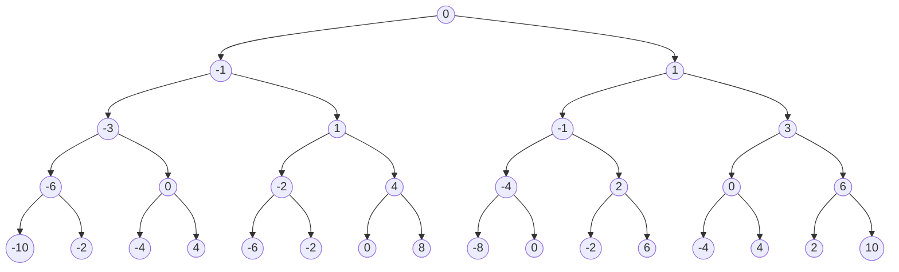

```
在一根无限长的数轴上，你站在0的位置。终点在target的位置。

每次你可以选择向左或向右移动。第 n 次移动（从 1 开始），可以走 n 步。

返回到达终点需要的最小移动次数。

示例 1:

输入: target = 3
输出: 2
解释:
第一次移动，从 0 到 1 。
第二次移动，从 1 到 3 。
示例 2:

输入: target = 2
输出: 3
解释:
第一次移动，从 0 到 1 。
第二次移动，从 1 到 -1 。
第三次移动，从 -1 到 2 。
注意:

target是在[-10^9, 10^9]范围中的非零整数。

来源：力扣（LeetCode）
链接：https://leetcode-cn.com/problems/reach-a-number
著作权归领扣网络所有。商业转载请联系官方授权，非商业转载请注明出处。
```


##  解题思路

初看这类题目，第一感觉就是递归回溯能够解决的，但是一般都会容易超时，而且这里要找回溯的条件也比较麻烦，就是什么时候需要该回溯？鉴于觉得递归回溯可能会超时，就没有往这个方向再细想了。

于是再根据题目的意思分析一下：在每一步，我们既可以选择往左，也可以选择往右移动，那么每一步，我们都有两种选择，将这些选择可视化（**走4步**）之后，我们可以得到下面这幅图：




可以看到，这个按步数走下来的结果，得到的就是一棵完全二叉树，在第K步，也就是深度为k的时候，总共有 2^k个节点 。而每一个节点对应的，就是相应步数可能会走出来的终点坐标。那么按道理来说，只要遍历这些节点，找到等于终点坐标的数值的节点，而该节点所在的深度，就是所需要的步数。

那么如何找到最少步数的节点呢 ？同样看上面那个图，最少步数的节点，必然是深度更小的节点，那么我们只需要按层遍历这棵树就好了，也就是用DFS来遍历就好了。

## 代码实现

```c#
public class Solution 
{
    public int ReachNumber(int target)
    {
        Queue<int> queue = new Queue<int>(10)  ; 

        int curStep = 0 ; 
        int layerCnt = 1 ; 

        queue.Enqueue(0) ; 
        while( queue.Count > 0 )
        {
            int curNum = queue.Dequeue() ;
            if( curNum == target )
            {
                break ; 
            }

            int tmpNextStep = curStep  ; 

            layerCnt--  ; 
            if( layerCnt == 0 )
            {
                curStep++ ; 
                layerCnt = (int)Math.Pow(2,curStep) ;    

                tmpNextStep = curStep ;            
            }
            else
            {
                tmpNextStep = curStep + 1 ;     
            }

            queue.Enqueue(curNum - tmpNextStep ) ; 
            queue.Enqueue(curNum + tmpNextStep ) ;    
        }

        return curStep ;
    }
}
```


## 解题结果

上面的解题思路，其实也是一种遍历的思路，而且是按层遍历整棵树，那么它的复杂度是根据树的节点数上升的，O(2^k)，k为树的深度，显然当终点坐标的数值越来越大的时候，需要遍历节点的数目就会越来越多，因此当然就是不通过了。。。不过没想到的是，相对于超时，内存先爆了，看来这个节点数增加的非常厉害。


